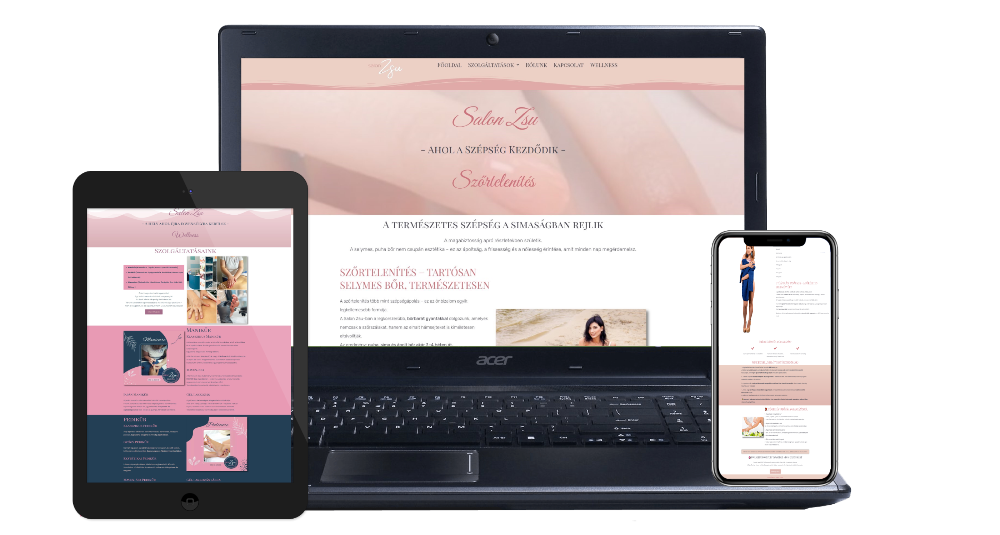
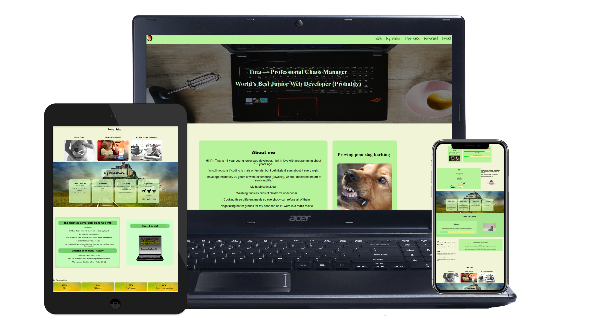

# Rebirth by Tina – Portfolio

Hi, I'm Tina – Web Designer & Logo Creator  
Specialized in WordPress, Elementor & Branding

## Live Websites
- Rebirth by Tina — https://rebirthbytina.site — Portfolio & Brand Website
- Salon Zsu — https://szalon-zsu.infinityfree.me — Beauty Salon Website
- CV Website — https://ktina007.github.io — Personal Portfolio Site (HTML/CSS, fun & playful style)
- ### Rebirth by Tina – Website Preview
A clean and modern website that presents my web design work and personal brand.

  

### Salon Zsu – Website Preview
An elegant and feminine website designed for a beauty salon, focused on showcasing services and building trust.

  

### CV Website – Personal Portfolio (HTML/CSS)
My first ever website — built by hand using only HTML & CSS!
A playful and humorous personal CV website — make sure to check it out, it will make you smile! 😄

  

## Logo Designs
(Showcase coming soon: Arany Limos, Kiky Gemstones, Salon Zsu, Rebirth by Tina)

## Skills
WordPress, Elementor, HTML, CSS  
Brand Identity • UI & Visual Design

## Contact
Portfolio website: https://rebirthbytina.site  
Email: tinaweb007@gmail.com  

➡️ I love adding humor and personality to my projects.

